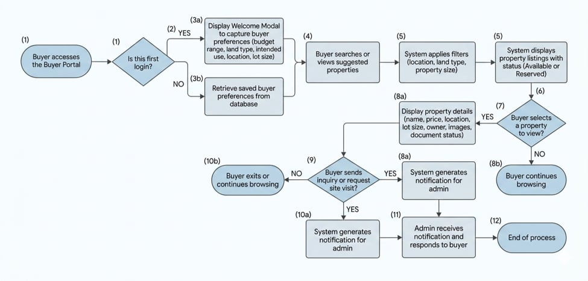
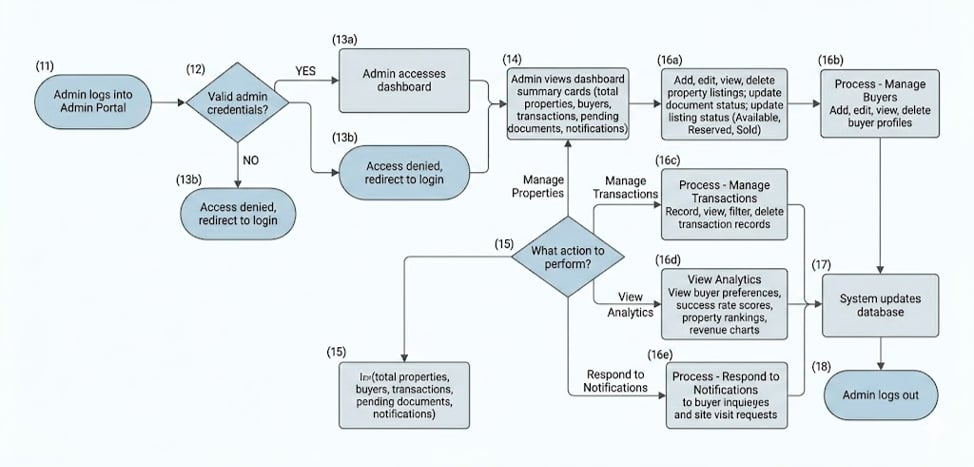

# IT332-Capstone-TerraGuide

Rey, Mark Xander B.
De Guzman, Matjannus S.
Alaras, Clyde Justin C.

*Think about YOUR capstone system:*
Does your system need to talk to other systems?
- No.
Does your system need external data?
- We've collected data from the Smart Works, owner Mrs. Maricel Buño
Does your system need export/import?
- Yes.
Does your system need automation?
- Yes, We will be using the Google Gemini API for the template generation of needed documents.

Document your answers — this is your project plan.

Title: TERRAGUIDE: A WEB-BASED PROPERTY INFORMATION MANAGEMENT
SYSTEM WITH INTELLIGENT DATA FILTERING AND SEARCH OPTIMIZATION
FOR SMARTWORKS BATANGAS.

*Planning of FeatureS*

During the planning stage of TerraGuide, the team identified the main features that will be included in the system based on the approved objectives. These planned features are divided into three main modules: Buyer Portal, Admin Portal, and Business Analytics.

 * For the Buyer Portal, the team plans to include features that will help buyers easily search and explore available properties. These include a map-based property view, search and filter options, personalized property recommendations, market trends, property details, document generation, and property inquiry features.

* For the Admin Portal, the team plans to develop tools that will help administrators manage property listings, buyer profiles, transaction records, and property statuses. Dashboard summaries, document verification tracking, and filtering tools are also being considered to make data management easier and more organized.

* For the Business Analytics module, the team plans to provide analytics features that can help administrators better understand buyer preferences, property performance, revenue trends, and market demand. These insights are expected to support decision-making and improve overall property management.

These planned features will serve as a guide for the design, development, and implementation of the TerraGuide system in the succeeding phases of the project.

*Techstack planning for TerraGuide*

*FRONTEND*
for the frontend, we will be using the following:
*React.js → We will build reusable components such as stat cards that show property statistics, dashboards,  navigation menus. Its Virtual DOM will ensure updates that are quick and responsive updates, which will be crucial for real-time property searches.

*Typescript → We will be integrating Typescript with Reactto provide static typing and interfaces. This will reduce runtime errors and improve maintainability, making the system more scalable as new features are implemented.

*Tailwind CSS → We will apply Tailwind’s utility‑first classes to design responsive dashboards directly from markup. This will speed up development and ensure consistent styling across the application.

*BACKEND*
For the backend, we will use:

*Node.js → We will implement Node.js We will apply Tailwind’s utility‑first classes to design responsive dashboards directly from markup. This will speed up development and ensure consistent styling across the application.

*REST APIs → We will design REST endpoints to connect the frontend, backend, and database. REST will be chosen over SOAP because of its simplicity and lightweight message format, ensuring smooth synchronization of property listings, client records, and transactions.

*DATABASE*
For the data management, we will use:

MongoDB → We will configure MongoDB Atlas to store property listings, customer information, and transaction histories. Its schema flexibility and ability to handle simultaneous read/write operations will make it suitable for dynamic property data. We will also set up indexing and replication to ensure scalability and high availability.

*VISUALIZATION AND ANALYSIS*
For the visualization and analysis, we will use:

*Chart.js → We will integrate Chart.js with React to provide lightweight, interactive charts for property analytics.

*D3.js → We will use D3.js for advanced, data‑driven visualizations such as drill‑down analysis and scenario simulations.

*AI‑powered BI dashboards → We will implement predictive analytics to forecast property efficiency, buyer preferences, and revenue projections, enhancing decision‑making for SmartWorks Batangas.

*DEVELOPMENT TOOLS*
For the development, we will use:

*Visual Studio Code (VS Code) → We will configure VS Code with extensions for Node.js, MongoDB, and REST API testing to streamline coding and debugging.

*GitHub → We will manage version control, collaboration, and CI/CD pipelines through GitHub to ensure smooth teamwork and project tracking.

*DEPLOYMENT*
For deployment, we will use:

*Vercel → We will deploy the frontend and backend using Vercel’s serverless platform. Its auto‑scaling, caching, and resource allocation features will ensure that TerraGuide remains responsive under varying traffic loads while minimizing infrastructure overhead.

## Flowchart for Buyer Portal
 
*Description*
The diagram shows the workflow of a buyer using a property recommendation and inquiry system. It begins when the buyer accesses the portal, searches and views properties based on their preferences, and ends when the buyer either continues browsing, submits an inquiry or site visit request, and receives a response from the administrator.

## Flowchart for Admin Portal

*Description*
The diagram illustrates the workflow of the Admin Portal, where the administrator logs in, verifies credentials, and accesses the dashboard to manage properties, buyers, transactions, and system notifications. It also allows the administrator to view analytics, respond to buyer inquiries and site visit requests, update records in the database, and securely log out of the system.

